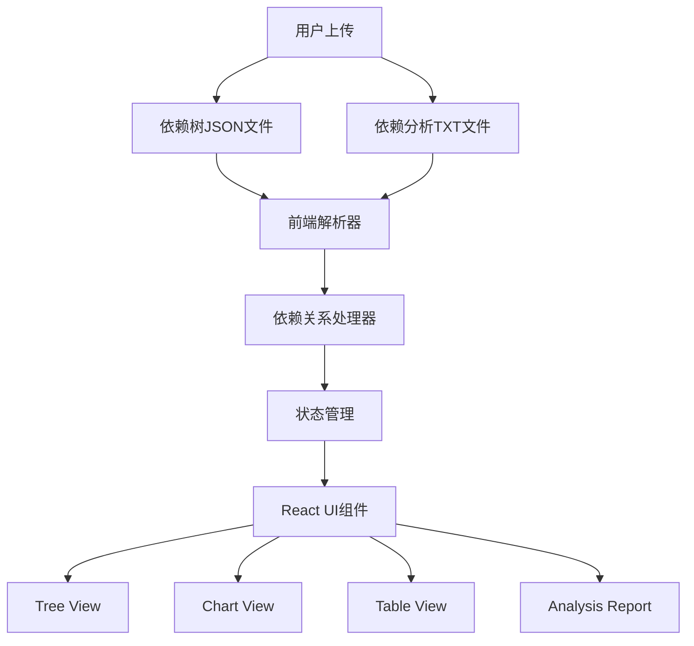

# Maven依赖分析工具 - 前端设计文档

## 1. 项目概述

本项目是一个用于可视化分析和管理Java Maven项目依赖关系的前端应用。该应用能够读取Maven项目生成的依赖树JSON文件以及依赖使用情况分析文本文件，通过直观的界面帮助开发者理解和优化项目的依赖结构。

### 1.1 项目目标

- 提供友好的界面来展示Maven项目的依赖树
- 可视化依赖使用情况分析结果
- 识别冗余或不必要的依赖
- 提供多种交互方式（树状结构、图表、过滤等）

### 1.2 核心功能

1. **依赖树可视化**：以交互式树形结构展示依赖关系
2. **依赖使用情况分析**：展示依赖的实际使用情况
3. **依赖搜索与过滤**：快速定位特定依赖
4. **依赖冲突检测**：识别潜在的依赖冲突
5. **导出功能**：导出分析结果为不同格式

## 2. 系统架构

### 2.1 高层架构


### 2.2 前端技术架构
完整的前端架构详图请参见 [frontend-architecture.md](frontend-architecture.md) 文件，其中包含了：
- React组件层级结构
- 状态管理方案
- 数据流处理
- UI组件设计

## 3. 数据格式规范

### 3.1 依赖树JSON格式

依赖树JSON遵循Maven Dependency Plugin的tree-mojo规范，根节点描述项目的构件信息，依赖项通过children数组递归表示。

#### 根节点结构：
- groupId: 项目或依赖的组ID（如 org.apache.maven.extensions）
- artifactId: 构件ID（如 maven-build-cache-extension）
- version: 版本号（如 1.2.1-SNAPSHOT）
- type: 构件类型（如 jar）
- scope: 依赖范围（如 compile, test 或空值表示项目本身）
- classifier: 分类器（如果存在，否则为空字符串）
- optional: 是否为可选依赖（true 或 false）
- children: 依赖对象数组，具有相同结构，表示传递性依赖

#### 嵌套依赖：
每个children数组中的依赖项遵循相同的结构，允许递归表示依赖树。

### 3.2 依赖使用情况分析格式

依赖使用情况分析来自`mvn dependency:analyze`命令输出，包含以下部分：
- `Used undeclared dependencies found:` 后面的数据表示未显式声明但被使用的依赖
- `Unused declared dependencies found:` 后面的数据表示显式声明但未被使用的依赖

## 4. 组件设计

### 4.1 文件上传组件

负责接收用户上传的依赖树JSON文件和依赖分析TXT文件。

#### 功能：
- 文件拖拽上传
- 文件格式验证
- 文件预览

### 4.2 依赖解析器组件

解析上传的JSON和TXT文件，构建内部依赖树结构。

#### 功能：
- 解析Maven依赖树JSON
- 解析依赖分析TXT文件
- 构建依赖关系映射

### 4.3 依赖树视图组件

以交互式树形结构展示依赖关系。

#### 功能：
- 展开/折叠节点
- 搜索和高亮
- 依赖详情展示
- 依赖状态标识（used/unused/undeclared）

### 4.4 分析报告组件

展示依赖使用情况分析结果。

#### 功能：
- 未声明但使用的依赖列表
- 已声明但未使用的依赖列表
- 冗余依赖分析结果
- 依赖冲突检测

## 5. 核心算法

### 5.1 依赖关系映射算法

将JSON依赖树和TXT分析结果关联起来，为每个依赖节点添加使用状态。

算法流程：
1. 遍历依赖树，构建依赖ID到节点的映射
2. 解析分析结果，提取未声明和未使用的依赖列表
3. 更新依赖树节点的使用状态
4. 生成分析报告

### 5.2 冗余依赖检测算法

识别以下类型的冗余依赖：
- 直接依赖A，但仅使用A的子依赖B的类，而不使用A的任何功能/类
- 这种情况下应直接使用B，而不是引入A去使用B

## 6. 技术实现

### 6.1 前端技术栈

- **React**: 用于构建用户界面的JavaScript库
- **TypeScript**: 为JavaScript添加静态类型检查
- **Tailwind CSS**: 实用优先的CSS框架，用于快速UI开发
- **状态管理**: 使用Context API或Redux Toolkit管理应用状态
- **图表库**: 使用D3.js或Visx进行复杂数据可视化
- **文件处理**: 使用FileReader API处理上传的文件

### 6.2 核心数据模型

#### DependencyNode（依赖节点）
```typescript
interface DependencyNode {
  id: string;            // 唯一标识符，格式为groupId:artifactId
  groupId: string;
  artifactId: string;
  version: string;
  type: string;
  scope: string;
  classifier: string;
  optional: boolean;
  children: DependencyNode[];
  expanded?: boolean;    // UI状态：是否展开
  selected?: boolean;    // UI状态：是否选中
  usageStatus?: 'used' | 'unused' | 'undeclared'; // 分析状态
  isRedundant?: boolean; // 是否为冗余依赖
}
```

#### AnalysisResult（分析结果）
```typescript
interface AnalysisResult {
  dependencyTree: DependencyNode;
  usedUndeclaredDeps: string[];  // 未声明但使用的依赖
  unusedDeclaredDeps: string[];  // 已声明但未使用的依赖
  redundantDeps: RedundancyReport[]; // 冗余依赖报告
  conflicts?: ConflictReport[];   // 冲突报告
}

interface RedundancyReport {
  dependency: string; // 冗余依赖坐标
  reason: string;     // 冗余原因
  alternatives: string[]; // 替代建议
}

interface ConflictReport {
  dependency: string; // 冲突依赖坐标
  versions: string[]; // 不同版本
  locations: string[]; // 出现位置
}
```

### 6.3 React组件结构

#### 主应用组件 (App.tsx)
- 文件上传区域
- 导航栏
- 主要内容区域
- 状态管理

#### 依赖树组件 (DependencyTreeView.tsx)
- 可展开/折叠的树形结构
- 搜索和过滤功能
- 依赖节点详情面板

#### 图表视图组件 (ChartView.tsx)
- 依赖关系可视化
- 依赖层级分布图
- 依赖大小占比图

#### 分析报告组件 (AnalysisReport.tsx)
- 依赖使用情况摘要
- 未声明依赖列表
- 未使用依赖列表
- 冗余依赖报告

### 6.4 文件结构

```
src/
├── components/              # React组件
│   ├── FileUploader/        # 文件上传组件
│   ├── DependencyTree/      # 依赖树组件
│   ├── ChartView/           # 图表视图组件
│   ├── AnalysisReport/      # 分析报告组件
│   └── common/              # 通用组件
├── hooks/                   # 自定义React Hooks
│   ├── useDependencyParser/ # 依赖解析Hook
│   └── useAnalysis/         # 分析功能Hook
├── types/                   # TypeScript类型定义
│   └── index.ts             # 类型定义文件
├── utils/                   # 工具函数
│   ├── parser.ts            # JSON和TXT解析器
│   ├── algorithms.ts        # 核心算法
│   └── helpers.ts           # 辅助函数
├── styles/                  # 样式文件
│   └── globals.css          # 全局样式，包含Tailwind配置
├── contexts/                # React Contexts
│   └── DependencyContext.ts # 依赖数据上下文
├── App.tsx                  # 主应用组件
└── main.tsx                 # 应用入口
```

## 7. 数据流

1. **输入阶段**：用户上传JSON和TXT文件
2. **解析阶段**：前端解析器将文件转换为内部数据结构
3. **处理阶段**：依赖关系处理器分析数据并添加状态标记
4. **渲染阶段**：React组件根据数据渲染UI
5. **交互阶段**：用户与界面交互，触发状态更新

## 8. 非功能性需求

### 8.1 性能要求
- 能够处理大型项目的依赖树（数千个依赖项）
- 快速加载和解析大型JSON文件
- 流畅的UI交互体验

### 8.2 可访问性
- 支持键盘导航
- 符合WCAG标准
- 支持屏幕阅读器

### 8.3 响应式设计
- 适配桌面和移动设备
- 不同屏幕尺寸下的布局调整
- 触摸友好的交互设计

## 9. UI/UX 设计

### 9.1 设计原则
- 简洁明了的界面设计
- 清晰的视觉层次
- 一致的交互模式
- 使用Tailwind CSS实现响应式布局

### 9.2 颜色方案
- 主色调：蓝色系（用于主要操作和链接）
- 成功色：绿色系（用于正常状态）
- 警告色：黄色/橙色系（用于警告状态）
- 错误色：红色系（用于错误状态）
- 中性色：灰度系（用于背景和文本）

### 9.3 组件设计
- 使用Tailwind CSS的实用优先类构建组件
- 设计可复用的UI组件
- 确保一致的间距和排版