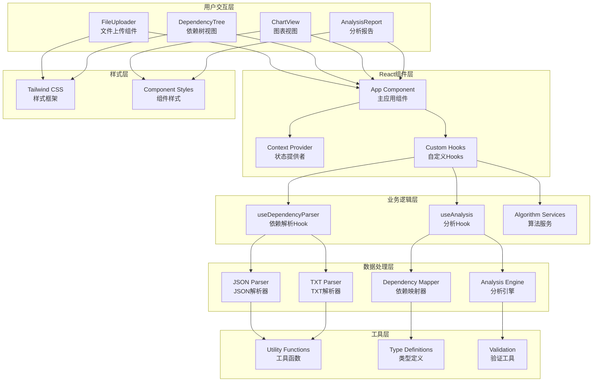
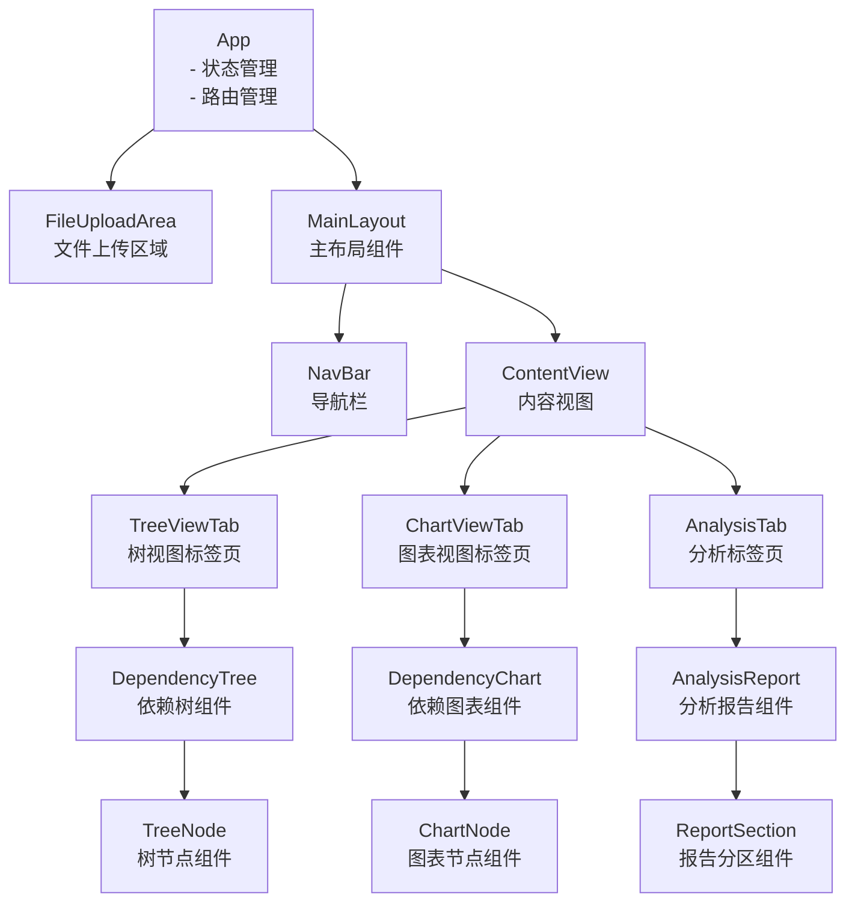
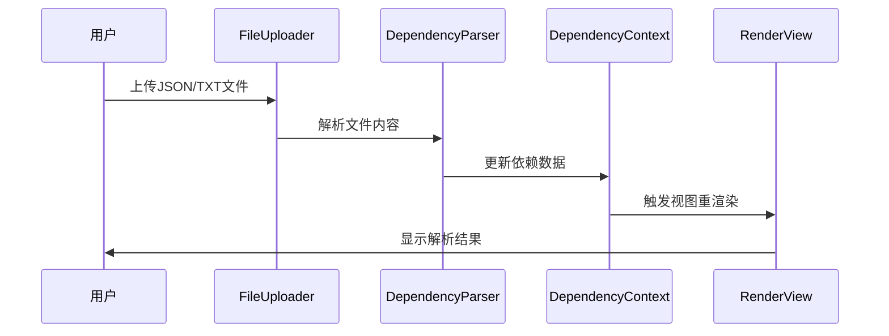
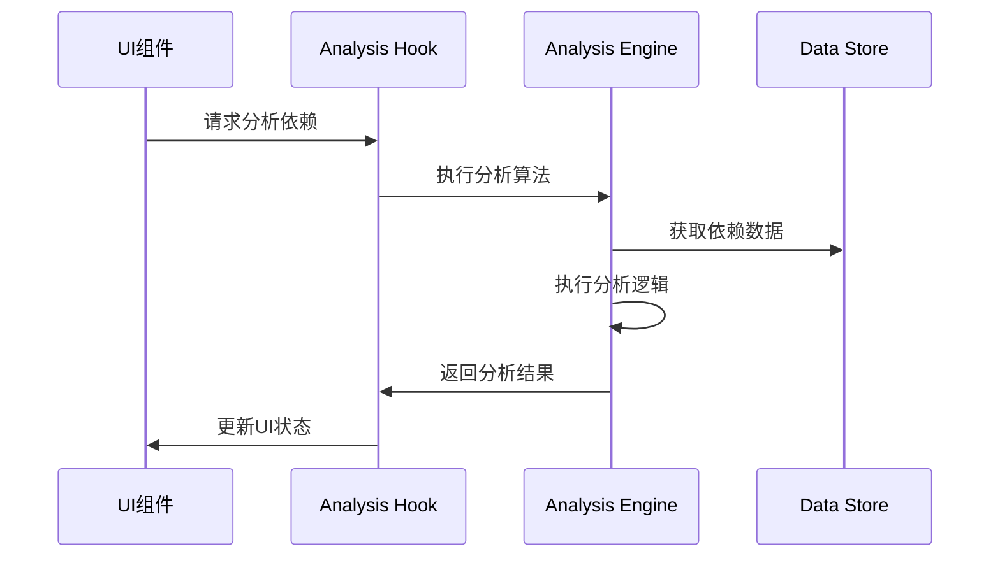
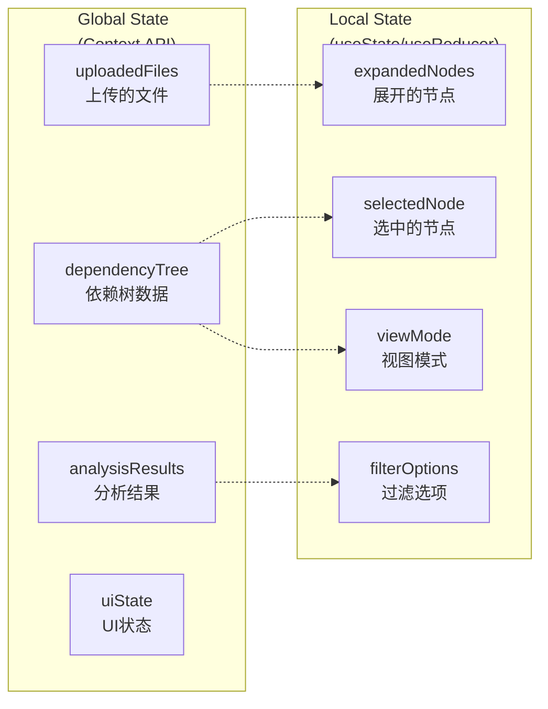

# Maven依赖分析工具 - 前端架构详图

## 1. 整体架构



## 2. React组件层级结构



## 3. 数据流

### 3.1 文件上传流程


### 3.2 依赖分析流程


## 4. 状态管理



## 5. 核心Hook设计

### 5.1 useDependencyParser Hook
```typescript
interface UseDependencyParser {
  parseJsonFile: (file: File) => Promise<DependencyNode>;
  parseTxtFile: (file: File) => Promise<AnalysisReport>;
  isLoading: boolean;
  error: string | null;
}
```

### 5.2 useAnalysis Hook
```typescript
interface UseAnalysis {
  analyzeDependencies: (tree: DependencyNode, report: AnalysisReport) => AnalysisResult;
  findRedundantDeps: (result: AnalysisResult) => RedundancyReport[];
  detectConflicts: (result: AnalysisResult) => ConflictReport[];
  analysisResult: AnalysisResult | null;
}
```

## 6. 样式架构

采用Tailwind CSS + 自定义组件的方式：

```
styles/
├── globals.css          # 全局样式和Tailwind配置
├── components/          # 自定义组件样式
│   ├── tree.css         # 依赖树样式
│   ├── chart.css        # 图表样式
│   └── report.css       # 报告样式
└── utilities/           # 自定义工具类
    ├── colors.js        # 自定义颜色配置
    └── spacing.js       # 自定义间距配置
```

## 7. 性能优化策略

1. **虚拟滚动**: 对于大型依赖树，使用React Virtual等库实现虚拟滚动
2. **懒加载**: 按需加载组件和数据
3. **Memoization**: 使用React.memo、useMemo和useCallback优化渲染
4. **代码分割**: 使用React.lazy进行代码分割
5. **数据结构优化**: 使用高效的树遍历算法