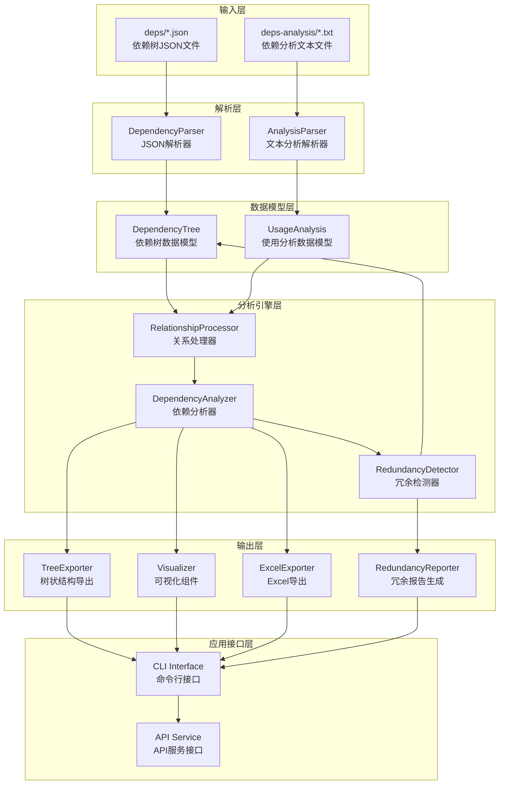
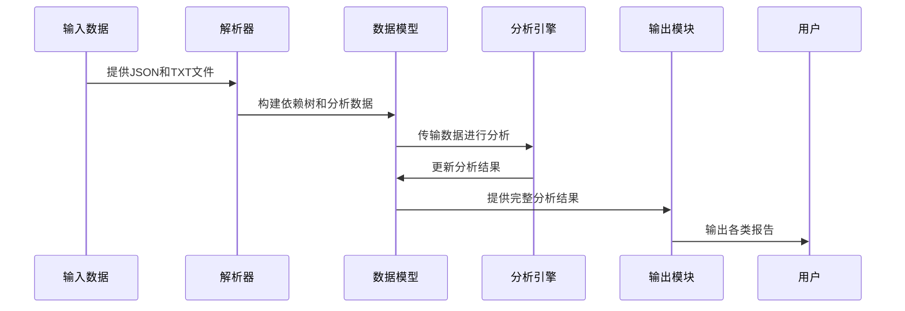

# Maven依赖分析工具 - 系统架构详图

## 1. 整体架构

## 2. 数据流向说明

### 2.1 解析阶段
1. DependencyParser读取deps目录下的JSON文件，将其转换为DependencyTree数据结构
2. AnalysisParser读取deps-analysis目录下的文本文件，提取使用情况信息

### 2.2 分析阶段
1. RelationshipProcessor整合DependencyTree和UsageAnalysis数据
2. DependencyAnalyzer执行基本分析，标记依赖的使用状态
3. RedundancyDetector检测冗余依赖并生成报告

### 2.3 输出阶段
1. TreeExporter生成树状结构输出
2. Visualizer生成可视化数据
3. ExcelExporter导出Excel格式
4. RedundancyReporter生成冗余依赖报告

## 3. 模块交互

## 4. 核心组件职责

### 4.1 解析器组件
- **DependencyParser**: 将Maven生成的JSON依赖树转换为内部数据结构
- **AnalysisParser**: 解析dependency:analyze命令输出的文本，提取使用情况

### 4.2 分析器组件
- **DependencyAnalyzer**: 对比依赖声明与实际使用情况
- **RedundancyDetector**: 检测间接依赖使用模式和冗余依赖
- **RelationshipProcessor**: 整合多源数据，建立依赖关系映射

### 4.3 输出组件
- **TreeExporter**: 生成层次化的依赖树视图
- **Visualizer**: 创建依赖关系图用于可视化展示
- **ExcelExporter**: 将分析结果导出为Excel格式
- **RedundancyReporter**: 生成详细的冗余依赖分析报告